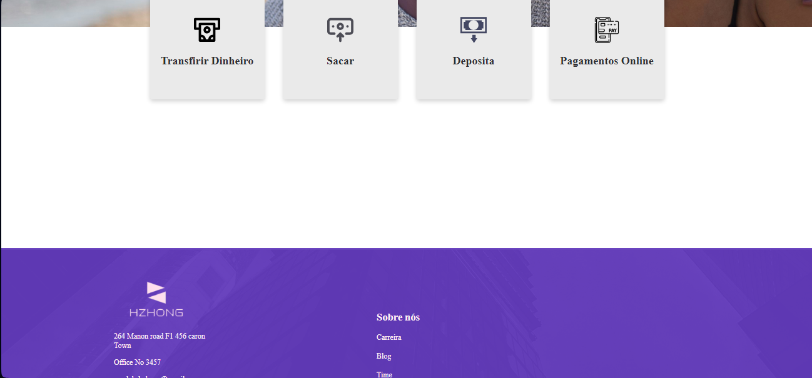
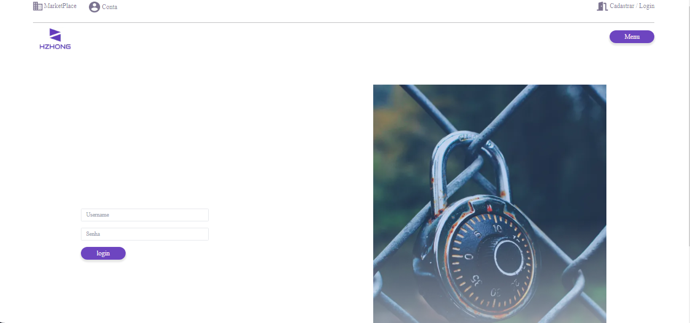
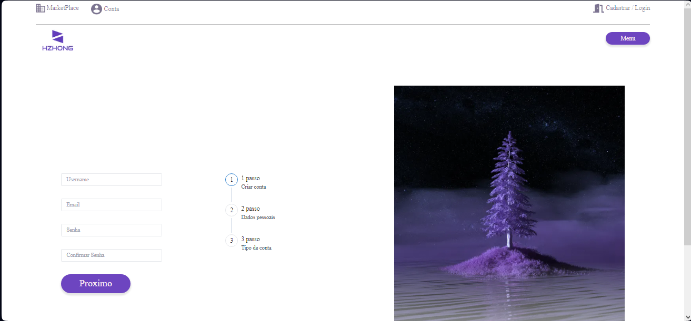
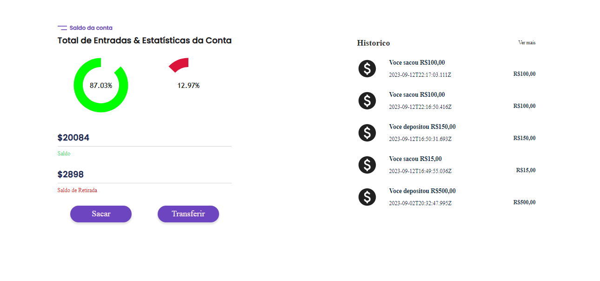
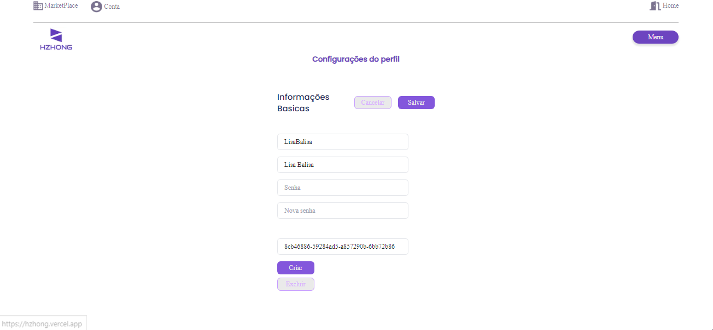
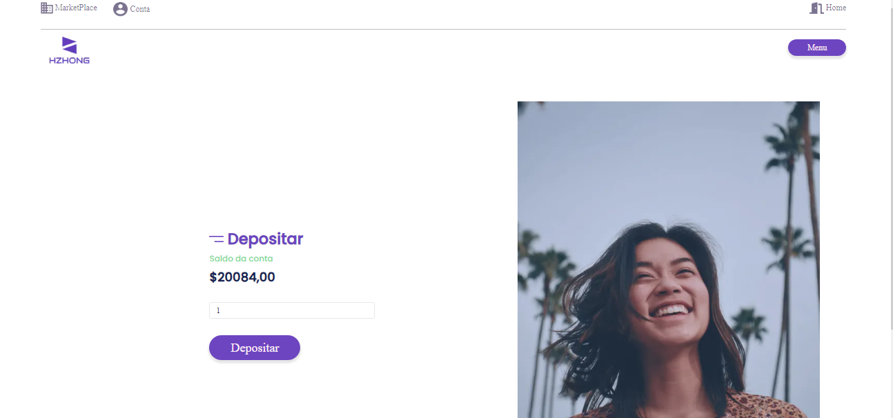
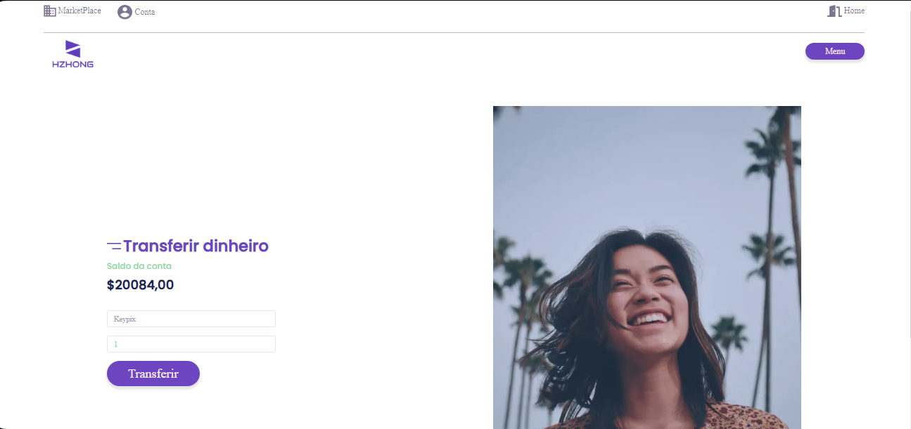
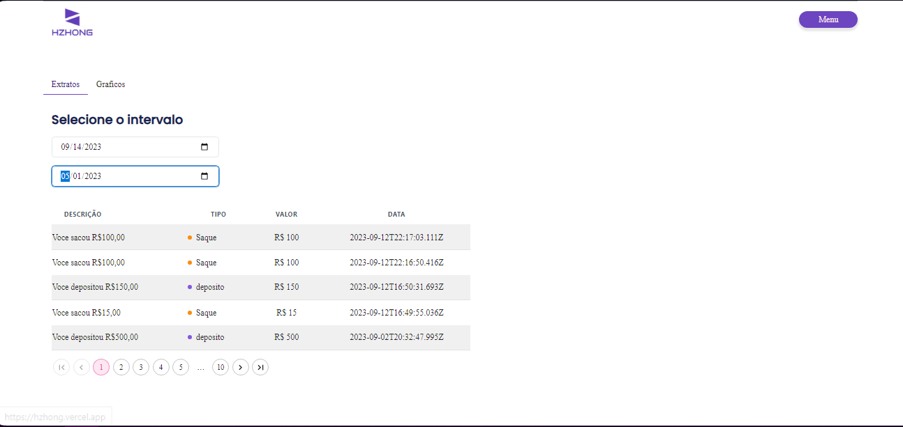
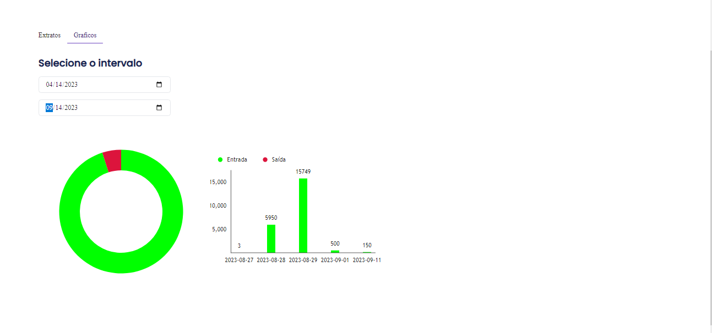

</p>
<h4 align="center"> 
	Hzhong App
</h4>

<p align="center">
	
</p>

<p align="center">
 <a href="#-sobre-o-projeto">Sobre</a> •
 <a href="#-funcionalidades">Funcionalidades</a> •
 <a href="#-layout">Layout</a> • 
 <a href="#-como-executar-o-projeto">Como executar</a> • 
 <a href="#-tecnologias">Tecnologias</a> • 
 <a href="#-autora">Autora</a> • 
 <a href="#user-content--licença">Licença</a>
</p>

<br>

## 💻 Sobre o projeto
O Banco Hzhong é a solução definitiva para suas necessidades financeiras. Com acesso a uma ampla gama de recursos e um dashboard intuitivo, você pode gerenciar suas finanças de forma eficaz e eficiente.

### Principais recursos do banco Hzhong:

Métricas Mensais: O Banco Hzhong oferece um painel de controle onde você pode acompanhar suas métricas financeiras mês a mês. Isso ajuda a manter o controle de suas finanças e a tomar decisões informadas.

Gráficos Interativos: Crie gráficos de pizza e coluna a partir dos dados do extrato. Esses gráficos fornecem uma representação visual clara de suas entradas e saídas, facilitando a compreensão de seus gastos e receitas.

Depositar: Com o Banco Hzhong, você pode facilmente depositar dinheiro em sua conta a qualquer momento. Basta seguir as etapas simples no aplicativo ou no site.

Sacar: Quando precisar de dinheiro em mãos, o Banco Hzhong permite que você efetue saques de sua conta de maneira conveniente e segura.

Transferir: Realize transferências de fundos para outras contas, sejam elas de amigos, familiares ou empresas, com facilidade e rapidez.

Receber: Aceite pagamentos de outras pessoas de forma eficiente, tornando mais fácil receber dinheiro por produtos ou serviços.

<br>

---

## ⚙️ Funcionalidades

- Depositar: Faça depósitos de dinheiro em sua conta com facilidade.

- Sacar: Retire dinheiro de sua conta quando necessário.

- Transferir: Transfira fundos para outras contas, sejam de amigos, familiares ou empresas.

- Receber: Aceite pagamentos de outras pessoas de maneira eficiente.

- Proteção de Dados: Utiliza criptografia avançada para proteger suas informações pessoais e financeiras.

- Interface Intuitiva: Uma interface amigável que torna a navegação e a utilização de todas as funcionalidades simples e intuitivas.

- Realizar login seguro na sua conta.

- Criar uma nova conta no Banco Hzhong.

---

<br>

## Layout

<br>












</div>

### figma
<a href="https://www.figma.com/file/AncBVtSKFpl6sopwVrVY71/Hzhong?type=design&node-id=0%3A1&mode=design&t=pq7bfqD6citshzkC-1">Clique para acessar</a>
<br>

---
## 🛣️ Como executar o projeto

Esse App precisa de alguns pré-requisitos para funcionar.

### Pré-requisitos

Antes de começar, você vai precisar ter instalado em sua máquina as seguintes ferramentas:
[Git](https://git-scm.com), [Node.js](https://nodejs.org/en/).
Além disto é bom ter uma IDE para trabalhar com o código como [VSCode](https://code.visualstudio.com/)

#### 🎲 Rodando o app Hzhong

```zsh

# Clone este repositório
$ git clone git@github.com:Amandalfs/Hzhong.git

# Acesse a pasta do projeto no terminal/cmd
$ cd hzhong

# Instale as dependências
$ npm install

# Execute a aplicação em modo de desenvolvimento
$ npm run dev

# O app inciará na porta:5170 - acesse http://localhost:5170 

## Obs:
O app vai precisar de uma API para funcionar perfeitamente, acesse este repositório:
```
<a href="https://github.com/Amandalfs/Api-bancoHzhong">Clique para acessar</a>


---

## 🛠 Tecnologias

As seguintes ferramentas foram usadas na construção do projeto:

#### []()**App** ([NodeJS](https://nodejs.org/en/))

-   **[React]()**
-   **[MaterialUi]()**
-   **[NextJs]()**
-   **[ChakraUI]()**
-   **[TailwindCss]()**
-   **[StyledComponents]()**
-   **[date-fns]()**
-   **[reac-form-hook]()**
-   **[js-cookie]()**
-   **[zod]()**
-   **[VictoryCharts]()**
-   **[axios]()**

> Veja o arquivo  [package.json](./package.json)

---

<br>

## 🧙‍♀️ Autora

<a href="https://www.linkedin.com/in/amanda-rodrigues-dfbd">
 
 <br />
 <sub><b>Amanda Rodrigues</b></sub></a>✨</a>
 <br />

---

## 📝 Licença

<!-- Este projeto esta sobe a licença [MIT](./LICENSE). -->

Feito com ❤️ por Amanda Rodrigues [Entre em contato!](https://www.linkedin.com/in/amanda-rodrigues-dfbd/)
